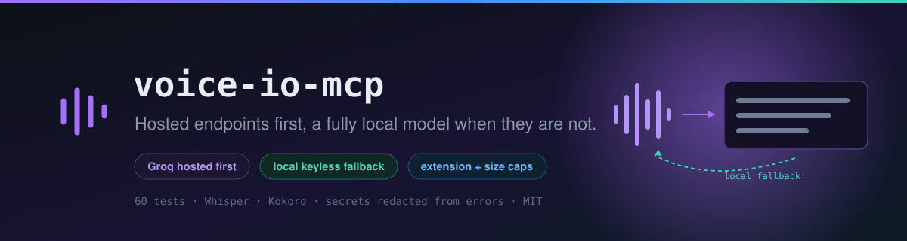
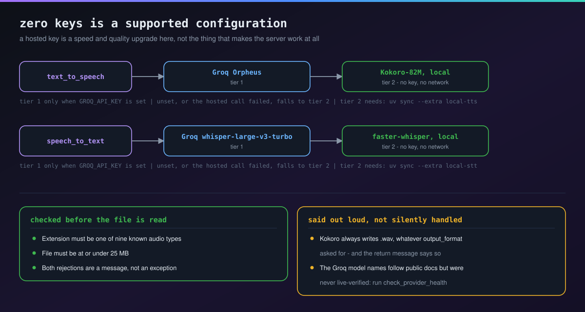
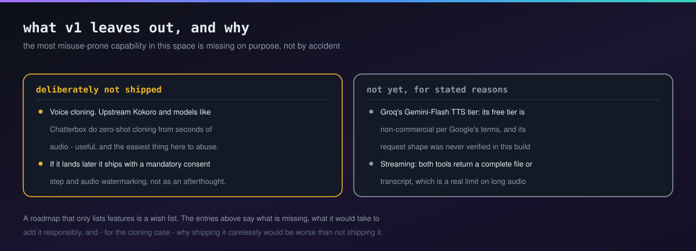

<div align="center">



# voice-io-mcp

[](LICENSE)
[](pyproject.toml)
[](https://modelcontextprotocol.io)
[](#-setup)

Text-to-speech and speech-to-text as two small MCP tools — Groq's free hosted endpoints first, a fully local, keyless model if Groq isn't reachable or configured at all.

</div>

Every other tool in this ecosystem's [nvidia-nim-mcp](https://github.com/Furkiozknn/nvidia-nim-mcp) wraps image/text/vision/safety/embedding models behind a "try a real provider, fall back if it fails" contract. Audio was the one capability nothing covered — this fills that gap, same philosophy: **a model being slow, rate-limited, or unconfigured should never take a tool down.**

## 📖 Table of Contents

- [Tools](#-tools)
- [The fallback chain](#-the-fallback-chain)
- [Setup](#-setup)
- [Example usage](#-example-usage)
- [Architecture](#-architecture)
- [Development](#-development)
- [Testing](#-testing)
- [Known limitations](#-known-limitations--roadmap)
- [License](#-license)

## 🧰 Tools

| Tool | What it does | Hosted tier (Groq, free) | Local fallback |
|---|---|---|---|
| 🔊 `text_to_speech` | Text (up to 4000 characters) → `.wav` file, saved to `output/` | Orpheus (`canopylabs/orpheus-v1-english`) | Kokoro-82M (Apache-2.0) |
| 🎙️ `speech_to_text` | Audio file → transcript (refuses non-audio extensions, symlinks to non-audio files, directories/FIFOs/devices and files over 25MB before reading a byte) | `whisper-large-v3-turbo` | faster-whisper (MIT) |
| 🗣️ `list_voices` | List known Groq Orpheus voice names for `text_to_speech`'s `voice` argument | — (static list) | — |
| 🩺 `check_provider_health` | Liveness probe for both hosted endpoints (spends one tiny TTS + one STT request of free-tier quota per call) + local-dependency availability check | both | both |

## 🔄 The fallback chain



Both tools try Groq first *only if* `GROQ_API_KEY` is set in `.env` — if it isn't, or if the Groq call fails for any reason, they drop straight to the local model. **This is the one meaningful difference from nvidia-nim-mcp's own pattern: every tool here works with zero API keys configured at all**, as long as the relevant optional extra is installed — a hosted key is a speed/quality upgrade, not a hard requirement.

Both tiers write `.wav`: Orpheus answers in WAV only, and so does Kokoro (encoding straight to mp3 depends on the local `libsndfile` build, which isn't guaranteed cross-platform). `output_format="mp3"` is still accepted for compatibility, and the tool's return message says it was answered with `.wav` rather than silently substituting formats.

Orpheus also takes at most **200 characters per request**. Longer text is split at sentence ends (then at spaces), sent as several requests, and the WAV parts are joined into one file with the standard library's `wave` module — mind the free tier's per-minute request allowance for long passages. If any piece fails, the whole call drops to the local model; no half-spoken file is left behind.

**Groq retired `playai-tts`** (deprecation announced 23 December 2025) in favour of Canopy Labs' Orpheus; this server moved with it. The PlayAI voice names (`Fritz-PlayAI`, …) no longer exist — use `list_voices` for the Orpheus ones (`autumn`, `diana`, `hannah`, `austin`, `daniel`, `troy`; default `hannah`).

**On model names:** `canopylabs/orpheus-v1-english` and `whisper-large-v3-turbo` follow Groq's public API documentation, but neither was live-verified with a real key while building this repo (no key was available in the build environment). Run `check_provider_health` once `GROQ_API_KEY` is set to confirm they're still current — Groq's free-tier model lineup shifts over time, the same "don't trust a name from memory" discipline `nvidia-nim-mcp` documents for its own model list.

## ⚙️ Setup

**1. Install the base package** (this project uses [`uv`](https://docs.astral.sh/uv/), not bare pip/venv):

```bash
uv sync
```

**2. (Optional) Enable Groq's hosted tier.** Copy `.env.example` to `.env` in the project root and fill it in:

```bash
cp .env.example .env
# GROQ_API_KEY=your-key-here
```

Get one free at [console.groq.com/keys](https://console.groq.com/keys) — no credit card. Without it, both tools go straight to their local fallback.

`.env.example` also documents `VOICE_IO_OUTPUT_DIR`, which controls where generated audio is written. It defaults to `output/` **under the directory the server is started in** — never inside the installed package, so a `pip install`ed copy never writes into `site-packages`.

**3. (Optional) Enable the local fallbacks** — each is an independent extra, install either or both:

```bash
uv sync --extra local-tts   # Kokoro-82M — also needs the `espeak-ng` system package
uv sync --extra local-stt   # faster-whisper
```

`espeak-ng` is used by Kokoro's phonemizer for out-of-distribution English and non-English text; straightforward English text works without it, but full quality/robustness wants it on `PATH` (`apt install espeak-ng` / `choco install espeak-ng` / `brew install espeak-ng`).

**4. Register it as an MCP server** with Claude Code (project or user scope):

```bash
claude mcp add --transport stdio voice-io -- uv run --project /path/to/this/repo voice-io-mcp
```

`voice-io-mcp` is the console command the project installs into its own environment, so this works from any directory. (`uv run --project … voice_io.py` does not: `--project` picks the environment, but the script path is still looked up in the directory Claude Code starts the server from.)

**5. Run `check_provider_health` once, after setting `GROQ_API_KEY`.** The model/voice names this server wires in (`canopylabs/orpheus-v1-english`, `whisper-large-v3-turbo`) were transcribed from Groq's public docs but never live-verified with a real key while building this — confirm they're still current before relying on the hosted tier. Each run sends one real TTS request ("hi") and one transcription of 0.1 s of silence — Groq bills a transcription as at least 10 seconds — so it spends a little free-tier quota every time; run it when something looks wrong, not before every call. This is the same "don't trust a name from memory" discipline `nvidia-nim-mcp` documents for its own model list. If a name has drifted, the local fallback still works regardless (once its extra is installed).

## ▶️ Example usage

```
"Read this changelog entry out loud"
→ text_to_speech  → saved to output/speech_20260901_120000.wav (model: groq/canopylabs/orpheus-v1-english)

"Transcribe this voice memo at C:\Users\me\Desktop\note.wav"
→ speech_to_text  → returns the transcript (model: groq/whisper-large-v3-turbo)

"What voices can I use for text_to_speech?"
→ list_voices     → returns the known Groq Orpheus voice names, one per line

"Is voice-io's Groq connection actually working right now?"
→ check_provider_health → per-endpoint OK/FAIL report, plus whether the local
                           extras are installed
```

## 🏗 Architecture

Single-file MCP server (`voice_io.py`), same shape as `nvidia-nim-mcp`'s `nvidia_image.py` and `mini-creative-toolkit`'s `toolkit.py` — one module, `@mcp.tool()`-decorated functions, no framework beyond the `mcp` package itself.

- **Hosted calls** go through [`litellm`](https://github.com/BerriAI/litellm) (`aspeech` / `atranscription`), the same library `nvidia-nim-mcp` and `model-comparison-harness` already use for their own multi-provider chat chains — one dependency covering chat, TTS, and STT uniformly across providers, rather than hand-rolling Groq's HTTP shape directly.
- **Local fallbacks** are lazy-loaded singletons (loaded once, on first real use, not at import time) guarded by a `threading.Lock` — a lesson carried over from a real bug caught in `nvidia-nim-mcp`'s own local-embedding fallback: without the lock, two concurrent calls could both start loading the same large model at once.
- **The STT health probe** builds a valid ~0.1s silent WAV in-memory using only Python's stdlib `wave` module — no binary audio fixture shipped in the repo, no extra dependency just to construct a liveness-check payload.
- **`speech_to_text` validates before it reads.** It reads whatever local path it's given and uploads the bytes to Groq (a third party) — so a wrong or maliciously-crafted path (e.g. an agent instructed to "transcribe the audio at `.env`") must be rejected locally instead of silently uploaded:
  - the extension allow-list (case-insensitive) is checked on the path as given *and* on the file it finally resolves to, so a symlink such as `memo.wav → ~/.env` is refused;
  - the resolved file is opened once (`O_NOFOLLOW`, `O_NONBLOCK` where the OS has them) and everything else is decided on that open descriptor: it must be a regular file — not a directory, FIFO or device — and at most 25MB, and at most 25MB + 1 byte is ever read, so a file that grows after the check is still refused;
  - both tiers receive those same validated bytes; nothing reopens the path, so it cannot be swapped between the check and the upload.
- **Errors never carry the key, and stdout stays clean.** Captured Groq error text has the API key scrubbed before it's returned or logged. litellm's "Give Feedback / Get Help" banner, which it otherwise `print()`s on every failed call, is switched off — on a stdio server stdout is the protocol channel.
- **Bounded hosted calls.** Each request has a 120 s timeout and one retry (the OpenAI client under litellm would otherwise retry twice, each attempt with its own timeout); after that the local fallback runs.

## 🛠 Development

```bash
uv sync --group dev
```

## 🧪 Testing

```bash
uv run pytest                              # the whole suite
uv run pytest tests/test_speech_to_text.py # one module
uv run pytest -q -rs                       # quiet, with skip reasons
```

The suite (`tests/`) mocks every `litellm` call — no `GROQ_API_KEY` or real network access needed, and nothing in it touches the network. It also exercises the *real*, unmocked local-fallback code paths against this repo's base test environment (where `kokoro`/`faster-whisper` are deliberately not installed, being optional extras), confirming both fallbacks fail closed — returning `False`/`None`, never raising — when their dependency is absent. The three real-model tests in `tests/test_local_integration.py` skip unless those optional extras *are* installed; a skip there is expected locally, not a failure. CI (`.github/workflows/ci.yml`) runs `uv run pytest` on Python 3.11 and 3.13 on every push/PR, plus a `yerel` job that installs both extras (and `espeak-ng`) and runs the real-model tests with skips treated as failures.

**Error contract under test:** invalid *input* (empty text, unknown `output_format`, a missing/non-audio/oversized file) raises `ToolError` from both tools; a tier that merely *failed* (Groq unreachable, no local extra installed) returns a plain descriptive string. The tests assert both halves so the two tools can't drift apart again.

## What this server can actually do

The expensive question about an MCP server is not what it promises but what it
**can do on your machine**: which credentials it can touch, where it connects,
what it runs. Answering that means reading the source, and most people will not.

On every push, [mcp-vet](https://github.com/Furkiozknn/mcp-vet) from the same
account audits this server from source and writes the whole report into the job
summary. Today's verdict: **NOT_FLAGGED** (no finding sets the verdict). The gate closes at HIGH and
above — and it also closes if the tool itself could not run, because "I could not
look" should not read as green.

Auditing our own server with our own tool had a side effect worth recording: adding
this job surfaced a real false positive in mcp-vet, which was fixed. A tool nobody
runs stays right by default.

## 🚧 Known limitations / roadmap



- **Voice cloning is deliberately out of scope for v1.** Kokoro's own upstream ecosystem and other open models (e.g. Chatterbox) support zero-shot voice cloning from a few seconds of reference audio — genuinely useful, but also the most misuse-prone capability in this space. If it's added later, it should ship with a mandatory consent-confirmation step and audio watermarking (Chatterbox bundles [Perth](https://github.com/resemble-ai/chatterbox), a watermarker, for exactly this reason) — not as an afterthought.
- **Groq's Gemini-Flash TTS tier was researched but not wired in.** Its free tier exists but is restricted to non-commercial/personal use per Google's terms, and its request/response shape wasn't verified during this build — a clean second hosted fallback tier to add later once both are confirmed.
- **No streaming.** Both tools return a complete file/transcript, not a chunked stream — fine for short clips and voice memos, a real limitation for long-form audio.
- **Output is always `.wav`**, on both tiers (see [The fallback chain](#-the-fallback-chain)) — Orpheus offers nothing else, and Kokoro skips mp3 encoding as a deliberate cross-platform-safety tradeoff.
- **Long text costs several hosted requests** — one per 200 characters, against the free tier's per-minute allowance; input is capped at 4000 characters (at most 20 requests) per call.
- **The content of an audio-named file is not inspected.** A regular file whose name ends in an allowed extension is uploaded as-is — the checks stop a path from *pointing* somewhere else, not someone from saving a secret as `notes.wav`.

## 📄 License

MIT — see [LICENSE](LICENSE). Kokoro-82M's weights are Apache-2.0; faster-whisper is MIT. Neither is vendored in this repo — both are optional dependencies, fetched from their own sources on install/first-use.

---

## More from this ecosystem

- **[mini-creative-toolkit](https://github.com/Furkiozknn/mini-creative-toolkit)** — 23 CPU-first media tools behind one MCP server
- **[local-notes-search-mcp](https://github.com/Furkiozknn/local-notes-search-mcp)** — ask your own files a question, with no network
- **[nvidia-nim-mcp](https://github.com/Furkiozknn/nvidia-nim-mcp)** — seven MCP tools on NVIDIA NIM's free tier
- **[mcp-vet](https://github.com/Furkiozknn/mcp-vet)** — audits an MCP server's source before you install it

<sub>All of them in one searchable page: **[furkiozknn.github.io](https://furkiozknn.github.io/)** — each card is generated from that repository's own <code>project-meta.json</code>.</sub>

<!-- mcp-name: io.github.Furkiozknn/voice-io-mcp -->
